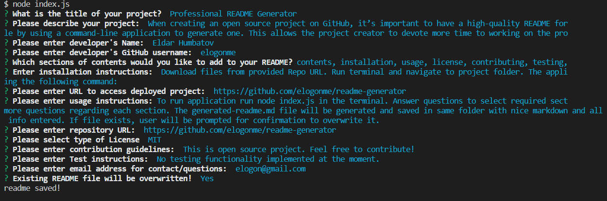

# DEMO Project  

  This is description of DEMO project to illustrate genereated readme file. This README was generated by **readme-generator**.
  All sections were selected to illustrate functionality.
  
## Contents

1. [Contents](#contents)
2. [Screenshot](#screenshot)
3. [Installation](#installation)
4. [Usage](#usage)
5. [License](#license)
6. [Contributing](#contributing)
7. [Testing](#testing)
8. [Questions](#questions)

### Screenshot

## Installation

Download files from provided repo URL. Make sure node is installed. Run npm install to install dependencies. Run app from CLI by typing `node index.js`.  
Application can be accessed at [https://github.com/elogonme/readme-generator](https://github.com/elogonme/readme-generator)

## Usage

Run node index.js from command line. Answer questions and select sections required. Answer more questions based on sections selected. If file exists warning will be given if user wants to overwrite. generated-readme.md will be saved in same folder.  
All app code is available at repository [https://github.com/elogonme/readme-generator](https://github.com/elogonme/readme-generator)

## License

Licensed under the 

## Contributing

See contribution guidlines below:  
Feel free to contribute by forking the repo.

## Testing

For testing follow guidlines below:  
Tests are not implemented at this time.

## Questions

For any questions use contacts below:  
        :construction_worker: Developer: Eldar Humbatov  
        :email: Email: [elogon@gmail.com](mailto:elogon@gmail.com)  
        :boom: GitHub: [https://github.com/elogonme](https://github.com/elogonme)
  
  *Generated by [readme-generator](https://github.com/elogonme/readme-generator/)*
  